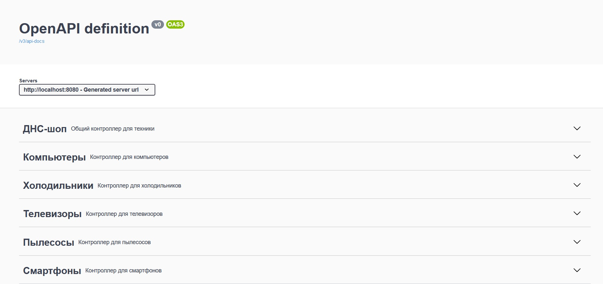
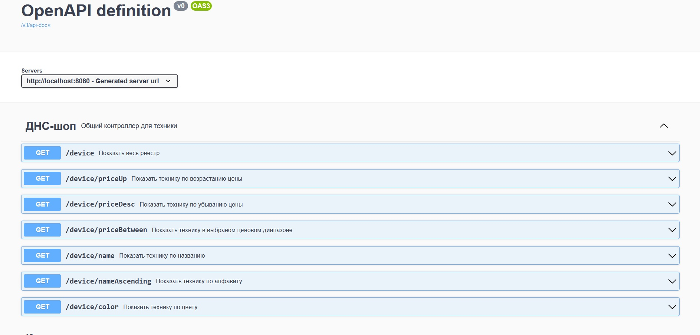
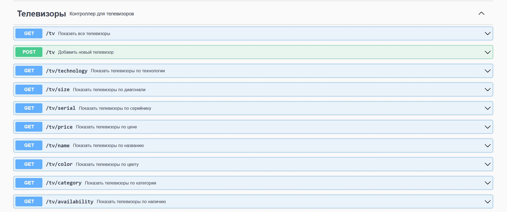
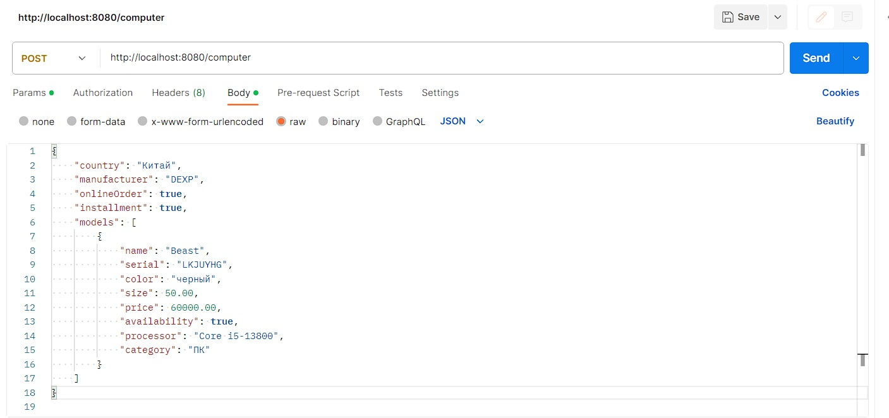
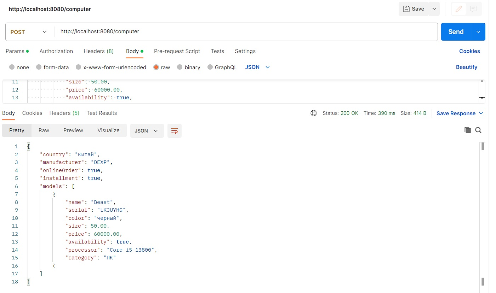
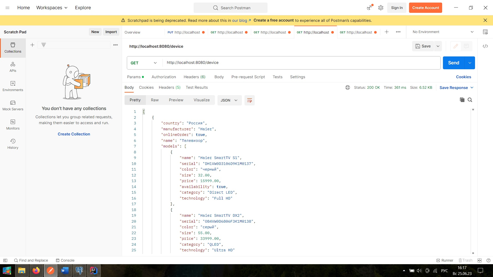

## REST-приложение. Реестр бытовой техники.

### Описание:
Реализован реестр техники (телевизоры, пылесосы, холодильники, смартфоны и ПК) с привязкой к ним моделей с собственными характеристиками. 

#### Задание:
2.	По выделенным атрибутам необходимо реализовать поиск по наименованию,
вне зависимости от регистра, а также реализовать фильтрацию по виду техники, цвету, цене (от/до). Остальные фильтры сделать зависимыми от выбора вида техники и фильтровать по атрибутам моделей. 
3.	Реализовать сортировку реестра техники по алфавиту и по стоимости;
4.	Реализовать возможность добавлять новые позиции и модели к ним, в зависимости от выбранного вида техники.

#### Стек:
-	Язык программирования: **Java 8**;
-   Сборка: **Maven 3.9.2** 
-	Frameworks: **Spring Boot 2.7.12, Spring Web, Spring Data JPA, Spring Validation, Spring Boot DevTools**;
-	База данных: **Postgres SQL 15**;
-   Миграция: **liquibase**;
-   Для сокращения кода: **Lombok**;
-	Библиотека для генерации документации: **springdoc-openapi v1.5.9**;

-   Для тестирования и взаимодействия использовался **Postman**;

#### Для запуска:

Java 8, Maven 3+, PostgreSql 15, swagger-ui/Postman

<br>

#### Запуск через IDE:
- Создать базу данных device_db

- В IDE:
````
Run class DeviceListApplication
````

#### Запуск через терминал:
- Создать базу данных device_db

- Старт командой:

````
mvn spring-boot:run 
````

#### Выполнение запросов:

http://localhost:8080/swagger-ui.html

Либо в Postman
````
http://localhost:8080
````

#### Демонстрация.
<br>

##### Общий вид приложения в Swagger-ui



<br>

##### Сервис на примере общего реестра техники


<br>

##### Сервис на примере телевизоров (остальные по аналогии).



<br>

##### Request & Response (В примере: Добавление нового компьютера в реестр).



<br>

##### Пример GET запроса, показать всю технику.
````
http://localhost:8080/device
````

